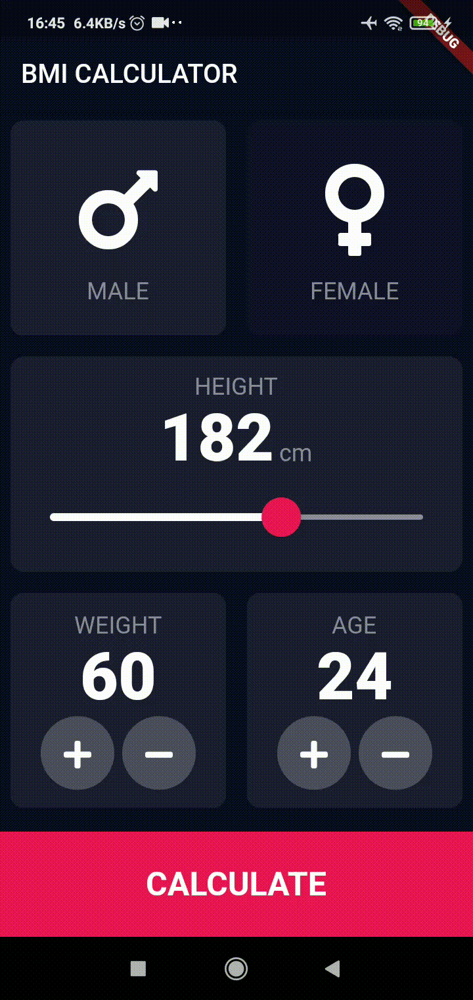

# BMI Calculator

The goal of this project was to create a Flutter application that is capable of calculating Body mass index. This project was created with the guidance of [Linkedin Learning Course](https://www.linkedin.com/learning/flutter-part-07-building-the-ui-or-flutter-part-07-building-uis)

## Demo

  

